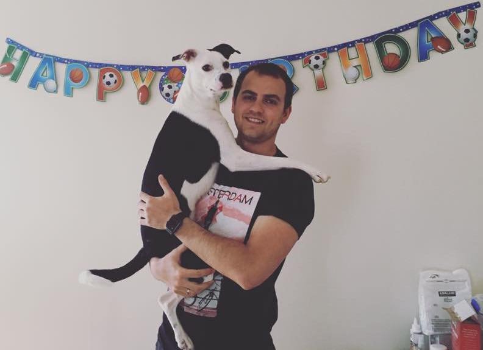

title: Training your best friend
output: demo_speech.html

--
#Training your best friend

--
###Meet Ozzie

--
###Also Ozzie

--
--
###Ozzie in action

<iframe width="800" height="600" src="https://www.youtube.com/embed/ndNnf1q31X8" frameborder="0" allowfullscreen></iframe>

--
###Resources
Sylvia-Stasiewicz, Dawn, and Larry Kay. _Training the Best Dog Ever: A 5 week Program Using the Power of Positive Reinforcement_. New York: Workman Pub., 2012. Print.
